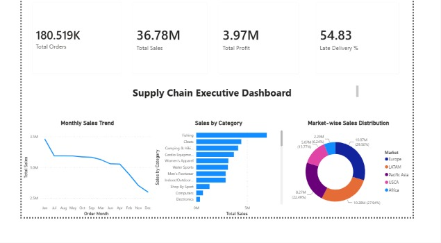

Supply Chain Analytics Dashboard

Overview

This project is an end-to-end Supply Chain Analytics solution developed using Databricks, SQL, and Power BI. The objective was to analyze supply chain operations and transform raw data into meaningful business insights through interactive dashboards.

The project demonstrates the complete analytics workflow, including data loading, data exploration, SQL-based analysis, and dashboard creation to support business decision-making.

Technologies Used

- Databricks
- PySpark
- SQL
- Power BI Desktop
- Git & GitHub

Dataset

The project uses the DataCo Smart Supply Chain dataset, which contains information related to:

- Customer Orders
- Products
- Categories
- Sales
- Profit
- Markets
- Shipping Modes
- Delivery Status
- Customer Details

Project Workflow

- Loaded the dataset into Databricks.
- Explored and analyzed the data using PySpark.
- Performed SQL analysis to calculate business metrics.
- Designed interactive dashboards in Power BI.
- Published the complete project on GitHub.

Dashboard Features

Executive Dashboard

- Total Orders
- Total Sales
- Total Profit
- Late Delivery Percentage
- Monthly Sales Trend
- Sales by Category
- Sales Distribution by Market

Customer & Operations Analysis

- Top 10 Customers by Sales
- Profit by Market
- Orders by Delivery Status
- Sales by Shipping Mode
- Interactive slicers for Market, Order Month, and Category

Key Business Insights

- Europe generated the highest overall sales.
- Fishing products recorded the highest sales among all categories.
- Standard Class was the most frequently used shipping mode.
- A significant percentage of orders experienced delivery delays.
- A small group of customers contributed a large share of total revenue.

Project Structure

```
Supply-Chain-Analytics-Dashboard
│
├── Databricks
│   ├── 01_Data_Loading.ipynb
│   └── 02_SQL_Analysis.ipynb
│
├── SQL
│   └── 02_SQL_Analysis.sql
│
├── Power BI
│   └── Supply_Chain_Analytics.pbix
│
├── Dataset
│   └── SupplyChainDataset.csv
│
├── Images
│   ├── dashboard_page1.jpeg
│   └── dashboard_page2.jpeg
│
└── README.md
```

Dashboard Preview

 Executive Dashboard



 Customer & Operations Analysis


Future Improvements

- Build a real-time dashboard using a live data source.
- Connect Power BI directly to Databricks in a production environment.
- Add predictive analytics for demand forecasting and delivery delay prediction.
- Develop additional KPIs for inventory and supplier performance.

Author
Sumana Karanam
Mahindra University
